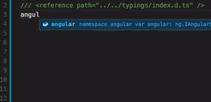
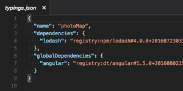
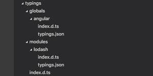

You can take advantage of one of the best features of TypeScript -- smart code completion (IntelliSense) for modules and packages while using Visual Studio Code (VSC) -- without needing to use it in a project.

  
*Visual Studio Code IntelliSense for AngularJS Using TypeScript Definitions*

To add this TypeScript feature to a JavaScript project, you will need to **install [TypeScript](http://www.typescriptlang.org/)** globally and the **TypeScript definition files (extension .d.ts)** for the modules and packages used in your project. We will be using the **[Typings](https://github.com/typings/typings)** package to manage TypeScript definition files. 

## 1. Install TypeScript and Typings
`$ npm install -g typescript` -- installs TypeScript globally  
`$ npm install -g typings` -- installs Typings globally

## 2. Setting Up Project
**Note:** run the command below from the root of your project.  
  
`$ typings init` -- creates typings.json, which will contain the list of the .d.ts files added to a project. This will allow you to simply run "$ typings install" in the future to install the .d.ts files of the libraries added to this file.  

  

## 3. Installing TypeScript Definition Files for Modules and Packages
`$ typings search --name <nameOfLibrary>` -- finds the .d.ts file for a library by name in the Typings registry.  
  
**Note:** run the commands below from the root of your project.  
  
`$ typings install <nameOfLibrary> --save`  
**or**  
`$ typings install dt~<nameOfLibrary> --global --save`  

- The command to run depends on the type of package. To learn more, visit the [Typings README.md](https://github.com/typings/typings/blob/master/README.md).  
- The `--save` flag will add a file to `typings.json`.

## 4. Typings Folder
After adding the first TypeScript definition through Typings to your project, a `typings` folder is created. This folder has an `index.d.ts` file, which contains a reference to all of the TypeScript definition files that have been added to the project.
  

## 5. Making Smart Code Completion Work
Now, in order to take advantage within a file of smart code completion, **add the tag below** at the top of the file. Ensure that the `path` attribute points to the location of `index.d.ts` within the `typings` folder in relation to the file with the tag.  
  
`/// <reference path="../../typings/index.d.ts" />` -- look at the first image in this post for an example.
