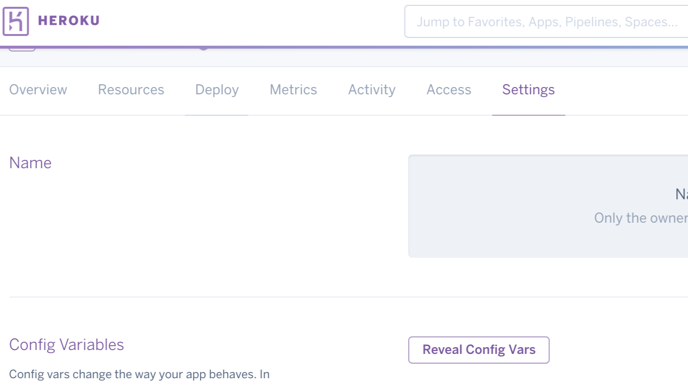

A Heroku `Procfile` has access to the `config variables` set for an app. This can be used to make the Procfile dynamic. 

In Heroku, an app's config variables can be set in two ways.
  
1.)  Using the web interface to navigate to the app's settings tab:
  

  
2.)  With the following command:
     
```
heroku config:set CONFIG_VAR_NAME=var_value -a appName
```

These variables can now be access by prefixing the variable name with `$`. This can be useful in a few ways. For instance, let's say that we want to dynamically set the heap size of a web server dynamically. We could first create a `HEAP_SIZE` configuration variable and then access it in the Procfile.
  
```
web: node --max_old_space_size=$HEAP_SIZE server.js
```

To learn more about a `Procfile`, visit [https://devcenter.heroku.com/articles/procfile](https://devcenter.heroku.com/articles/procfile "Heroku Procfile Info").  

That's it!
